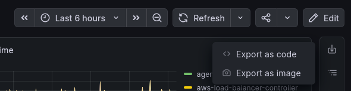
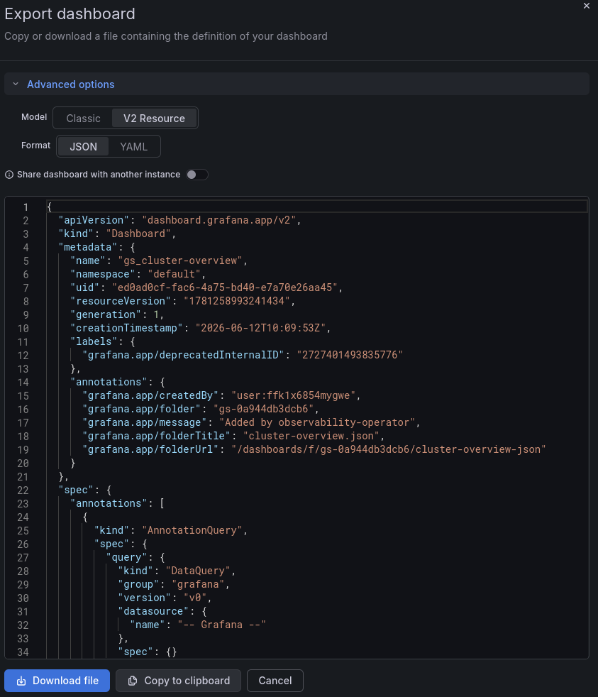

# Contributing

## Exporting dashboards from Grafana

When you add a new dashboard or update an existing one, the JSON committed here must be a **complete** Grafana dashboard. Two schemas are supported:

- **v2 (preferred)** – the newer model, identified by `"apiVersion": "dashboard.grafana.app/v2"` together with `kind: Dashboard`, `metadata` and `spec`.
- **v1** – the classic Grafana dashboard model (top-level `schemaVersion`, `panels`, `templating`, …).

### The right way: "Export as code"

1. Open the dashboard in Grafana.
2. Open the **share/export** menu in the top-right toolbar and choose **Export as code**.

   

3. In the **Export dashboard** dialog, expand **Advanced options** and set:
   - **Model**: **V2 Resource** (preferred) — or **Classic** to export the v1 schema.
   - **Format**: **JSON**.
   - **Share dashboard with another instance**: **OFF**. Our dashboards reference a `$datasource` template variable and are wired up by the observability operator, so the datasource must stay as it is. Turning this on rewrites datasources into `__inputs`/`__requires`, which we do not want here.

   

4. Click **Download file** (or **Copy to clipboard**) and commit it under the correct team sub-chart and folder path (see [directory structure](README.md#dashboard-directory-structure)).

This produces a complete file: with **V2 Resource** the full v2 resource (the `apiVersion` / `kind` / `metadata` / `spec` envelope), or with **Classic** the full v1 model.

### The common mistake: the "JSON Model" view

Do **not** copy the JSON shown under **Dashboard settings → JSON Model**. For a v2 dashboard that view shows only the dashboard *spec* with the `apiVersion` / `kind` / `metadata` / `spec` envelope stripped off — you get top-level `elements` and `layout` but no `apiVersion` and no `schemaVersion`. Grafana cannot import that form, so it is neither a valid v1 nor a valid v2 dashboard and it must not be committed.

### How this is enforced

The `check-dashboard-schema` check fails any dashboard that is neither v1 nor v2 — which is exactly what catches a file pasted from the JSON Model view. It runs in CI on every pull request that touches dashboards, and you can run it locally:

```sh
make check-dashboard-schema
```

If a dashboard is rejected, re-export it with **Export as code** as described above.
